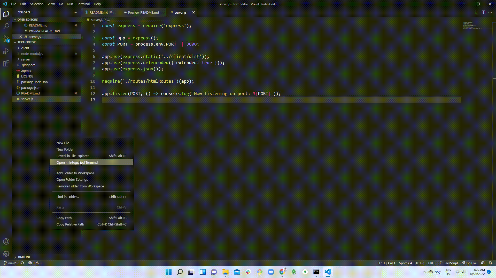

# text-editor
<h1 align="center"> PWA - TEXT EDITOR 🚩</h1>
<br>
<p align="center">
  <a href="#">
  
  <a href="#">
  
  <a href="#">
  
  <a href="#">
  
  <a href="#">
  
  <a href="#">
  
  <a href="#">
  
  <br>
  <a href="#">
  
  <a href="#">
  
  <a href="https://github.com/ThiHoangPham/text-editor/blob/main/LICENSE">
  
  </a>
  <a href="#">
  
  <a href="#">
  
  </a>
  <a href="#">
  
  </a>
  <a href="#">
  
  </a>
  <a href="#">
  
  </a>
</p>
<hr>

  <h3 align="center">
    <p align="center">
      <a href="https://github.com/ThiHoangPham/text-editor"><strong>Explore the docs »</strong></a>
      <br />
      <br />
      <a href="#live-demo-heroku">Demo</a>
      ·
      <a href="https://github.com/ThiHoangPham/text-editor/issues">Report Bug</a>
      ·
      <a href="https://github.com/ThiHoangPham/text-editor/issues">Request Feature</a>
    </p>
  </table>

  <details>
    <summary>Table of Contents</summary>
    <ul>
      <li><a href="#about-the-project">About The Project</a>
      <li><a href="#user-story">User Story</a></li>
      <li><a href="#acceptance-criteria">Acceptance Criteria</a></li>
      <li><a href="#live-demo-heroku">Live Demo Heroku</a></li>
      <li><a href="#installation">Installation</a></li>
      <li><a href="#usage">Usage</a></li>
      <li><a href="#contributor">Contributor</a></li>
      <li><a href="#contribution">Contribution</a></li>
      <li><a href="#license">License</a></li>
      <li><a href="#more-about-me">Questions & Contact</a></li>
    </ul>
  </details>

  <br />

# About The Project
  Build a Text Editor that runs in the browser. The app will be a single-page application that meets the PWA criteria. Additionally, it will feature a number of data persistence techniques that serve as redundancy in case one of the options is not supported by the browser. The application will also function offline.

  

# User Story
```
AS A developer
I WANT to create notes or code snippets with or without an internet connection
SO THAT I can reliably retrieve them for later use
```
# Acceptance Criteria
```
GIVEN a text editor web application
WHEN I open my application in my editor
THEN I should see a client server folder structure
WHEN I run `npm run start` from the root directory
THEN I find that my application should start up the backend and serve the client
WHEN I run the text editor application from my terminal
THEN I find that my JavaScript files have been bundled using webpack
WHEN I run my webpack plugins
THEN I find that I have a generated HTML file, service worker, and a manifest file
WHEN I use next-gen JavaScript in my application
THEN I find that the text editor still functions in the browser without errors
WHEN I open the text editor
THEN I find that IndexedDB has immediately created a database storage
WHEN I enter content and subsequently click off of the DOM window
THEN I find that the content in the text editor has been saved with IndexedDB
WHEN I reopen the text editor after closing it
THEN I find that the content in the text editor has been retrieved from our IndexedDB
WHEN I click on the Install button
THEN I download my web application as an icon on my desktop
WHEN I load my web application
THEN I should have a registered service worker using workbox
WHEN I register a service worker
THEN I should have my static assets pre cached upon loading along with subsequent pages and static assets
WHEN I deploy to Heroku
THEN I should have proper build scripts for a webpack application
```

# Live Demo Heroku: 
<a href="https://just-another-text-editor.herokuapp.com/">
  
  </a>

# Installation
```
Clone/Fork the Repo to your Local, and run command:

`npm install`
```
# Usage
```
Run the following command at the root of your project:

`npm start`
```
# Contributor
<a href="https://github.com/ThiHoangPham/text-editor">
  
  </a>

# Contribution
This how you can contribute to this project:
```
> Clone the project to your local 
> Create your own branch
> Add contribution codes/commit/push to remote repo
> Create a pull request
```
# License
  Distributed under the [MIT](https://github.com/ThiHoangPham/text-editor/blob/main/LICENSE).

# More About Me
  <a href="https://github.com/ThiHoangPham">
  
  <a href="https://thihoangpham.github.io/updated-professional-materials/">
  
  <a href="mailto:thaihoangpham2008@gmail.com">
  
  </br>
  <p align ="right"><a href="#">↥ back to top</a></p>

- - -

© 2021 Thai Hoang Pham (Adam): PWA - Text Editor
